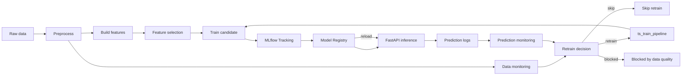

# TS Project: прогнозирование сальдо ликвидности

Проект строит production-ready ML-пайплайн для ежедневного прогноза сальдо показателя, связанного с потоками ликвидности банка. В репозитории собраны исследовательские ноутбуки, batch-пайплайны подготовки данных и обучения, FastAPI-сервис для inference, MLflow Model Registry, Airflow DAG'и мониторинга и автоматического retraining, а также заготовка production-развертывания в Yandex Cloud.

## Бизнес-контекст

Прогнозируемая величина помогает оценивать дневное сальдо поступлений и списаний. На основании прогноза позиционер принимает решение, как управлять ликвидностью:

- при ожидаемом профиците средства можно разместить overnight;
- при ожидаемом дефиците нужно заранее оценить потребность в привлечении средств;
- более точный прогноз снижает стоимость ошибок и помогает эффективнее использовать свободную ликвидность;
- бизнес-метрика в проекте учитывает разницу между альтернативными сценариями размещения и фондирования.

## Что реализовано

- Feature engineering для временного ряда: лаги, rolling-признаки, календарные, налоговые и макро-признаки.
- Feature selection с фильтрацией константных, сильно пропущенных, коррелирующих и низкоинформативных признаков.
- Обучение модели через FLAML с fallback-моделями из scikit-learn.
- Оценка качества по MAE/RMSE/MAPE и бизнес-метрикам.
- MLflow Tracking и Model Registry для экспериментов, артефактов и promotion модели.
- FastAPI inference service с загрузкой модели из MLflow Registry, healthcheck, hot reload и Prometheus metrics.
- Логирование production predictions в parquet/csv или S3-compatible storage.
- Batch monitoring данных, предсказаний, drift, anomaly/change points и деградации качества.
- Airflow orchestration для train pipeline и monitoring/retraining loop.
- DVC pipeline для воспроизводимого локального запуска основных стадий.
- Docker Compose окружение для локального MLflow, API и Airflow.
- План production-развертывания в Yandex Cloud.

## Архитектура



Логика production loop:

1. API обслуживает `/predict` и `/predict_from_features`.
2. Каждый успешный inference пишется в prediction logs.
3. Airflow DAG `ts_model_monitoring` ежедневно проверяет данные, predictions, drift, anomalies и качество, если доступны фактические значения.
4. `pipelines/decide_retrain.py` принимает решение `skip`, `retrain` или `blocked`.
5. При `retrain` мониторинговый DAG запускает `ts_train_pipeline`.
6. Train pipeline обучает candidate model, логирует ее в MLflow и сравнивает с текущей production/champion моделью.
7. Если candidate лучше, модель продвигается в registry, после чего API получает `POST /reload_model`.

## Структура репозитория

```text
app/                  FastAPI inference service
configs/              Основной YAML-конфиг проекта
dags/                 Airflow DAG'и training и monitoring
Data/                 Локальные исходные и промежуточные данные
DS_research/          Исследовательский код и прототипы
docs/                 Документация по production-развертыванию
notebooks/            Ноутбуки EDA, feature engineering и selection
pipelines/            CLI-скрипты batch-пайплайнов
requirements/         Дополнительные зависимости, включая Airflow
scripts/              Утилиты для API payload/schema
src/                  Библиотечный код проекта
TS_model/             Совместимый пакет/модуль модели
dvc.yaml              DVC pipeline
docker-compose.yml    Локальная инфраструктура
Dockerfile.*          Образы API, Airflow и batch pipeline
```

Ключевые модули:

- `src/features/` - сборка признаков, схемы и feature selection.
- `src/models/` - обучение, оценка, MLflow integration и promotion.
- `src/monitoring/` - quality checks, drift, anomaly detection, reports и retrain decision.
- `src/io/s3.py` - чтение и запись локальных и S3-compatible URI.
- `app/model_loader.py` - загрузка model bundle из MLflow или совместимых artifact URI.
- `app/prediction_logger.py` - запись production predictions.

## Быстрый старт локально

### 1. Подготовить окружение

```bash
python -m venv .venv
source .venv/bin/activate
pip install -r requirements.txt
```

Создайте `.env` из шаблона:

```bash
cp .env.example .env
```

Для полностью локального запуска можно оставить большинство значений по умолчанию, но реальные ключи Yandex Cloud и S3 не нужно коммитить в репозиторий.

### 2. Запустить MLflow и API

```bash
docker compose up --build mlflow-postgres mlflow api
```

После старта доступны:

```text
MLflow: http://localhost:5001
API:    http://localhost:8000
```

Проверить API:

```bash
curl http://localhost:8000/health
curl http://localhost:8000/model_status
```

Если модель еще не обучена или registry пустой, API останется доступным, но `/health` покажет `model_loaded: false`, а predict endpoint'ы вернут `503`.

### 3. Запустить Airflow

```bash
docker compose up airflow-init
docker compose up airflow-webserver airflow-scheduler
```

Airflow UI:

```text
http://localhost:8080
login: airflow
password: airflow
```

Ручной запуск training DAG:

```bash
docker compose exec airflow-scheduler airflow dags trigger ts_train_pipeline
```

Ручной запуск monitoring DAG:

```bash
docker compose exec airflow-scheduler airflow dags trigger ts_model_monitoring
```

## Конфигурация

Основной конфиг находится в `configs/config.yaml`.

Важные секции:

- `project_name`, `target_col`, `date_col`, `prediction_horizon` - базовые параметры задачи.
- `s3` и `yandex_cloud` - layout Object Storage и production URI.
- `mlflow` - experiment, registered model name, aliases и artifact root.
- `training` - тип модели, time budget, validation split, random seed.
- `evaluation` и `promotion` - метрики качества и правила promotion.
- `monitoring` - пороги PSI, деградации MAE и anomaly retraining.
- `feature_engineering` - лаги, rolling windows и группы признаков.
- `feature_selection` - правила отбора признаков.

Большинство URI и секретов задаются через `.env` или Airflow Variables. Пример лежит в `.env.example`.

## DVC pipeline

Для воспроизводимого локального запуска есть `dvc.yaml` со стадиями:

1. `preprocess` - чтение `Data/final.csv`, очистка и сохранение parquet.
2. `build_features` - генерация признаков и feature pipeline.
3. `select_features` - отбор признаков и отчёт selection.
4. `train_model` - обучение и логирование в MLflow.
5. `evaluate_model` - оценка champion/candidate модели.

Запуск:

```bash
dvc repro
```

Посмотреть метрики:

```bash
dvc metrics show
```

Основные локальные артефакты DVC пишутся в:

```text
artifacts/dvc/
```

## Batch-пайплайны

Все основные шаги можно запускать напрямую из `pipelines/`.

Подготовка данных:

```bash
python -m pipelines.preprocess \
  --input-uri Data/final.csv \
  --output-uri artifacts/interim/data.parquet \
  --config configs/config.yaml
```

Сборка признаков:

```bash
python -m pipelines.build_features \
  --input-uri artifacts/interim/data.parquet \
  --output-uri artifacts/features/features.parquet \
  --feature-pipeline-uri artifacts/features/feature_pipeline.pkl \
  --feature-schema-uri artifacts/features/feature_schema.json \
  --config configs/config.yaml \
  --mode train
```

Обучение:

```bash
python pipelines/train.py \
  --features-uri artifacts/features/features.parquet \
  --feature-pipeline-uri artifacts/features/feature_pipeline.pkl \
  --experiment-name ts-project \
  --registered-model-name ts-project-forecast-model \
  --config configs/config.yaml \
  --run-name local-train \
  --promote-if-better true
```

Оценка:

```bash
python pipelines/evaluate.py \
  --features-uri artifacts/features/features.parquet \
  --config configs/config.yaml \
  --output-uri artifacts/metrics/champion_evaluation.json
```

## MLflow и Model Registry

Локально MLflow запускается через `docker-compose.yml` с PostgreSQL backend store. Это важно для полноценной работы Model Registry.

```bash
docker compose up --build mlflow-postgres mlflow
```

По умолчанию:

- tracking URI: `http://localhost:5001`;
- experiment: `ts-project`;
- registered model: `ts-project-forecast-model`;
- alias из конфига: `champion`;
- compose API использует `MODEL_ALIAS=latest`, если не переопределено в `.env`.

Train pipeline логирует:

- параметры модели и обучения;
- MAE/RMSE/MAPE;
- бизнес-метрики;
- список признаков и date ranges;
- model artifact;
- feature pipeline;
- `config.yaml`;
- локальный training report.

Отчёты обучения сохраняются в:

```text
artifacts/training/
```

## FastAPI inference service

Сервис находится в `app/` и запускается командой:

```bash
uvicorn app.main:app --host 0.0.0.0 --port 8000
```

Основной режим загрузки модели:

```bash
MODEL_SOURCE=mlflow
MLFLOW_TRACKING_URI=http://localhost:5001
REGISTERED_MODEL_NAME=ts-project-forecast-model
MODEL_ALIAS=champion
```

Также поддерживается совместимый режим прямой загрузки артефактов:

```bash
MODEL_URI=models:/ts-project-forecast-model@champion
FEATURE_PIPELINE_URI=
MODEL_METADATA_URI=
```

Для S3/Yandex Object Storage нужны S3-compatible credentials:

```bash
AWS_ACCESS_KEY_ID=replace_me
AWS_SECRET_ACCESS_KEY=replace_me
YANDEX_S3_ENDPOINT_URL=https://storage.yandexcloud.net
YANDEX_S3_REGION=ru-central1
```

Endpoint'ы:

```text
GET  /
GET  /health
GET  /metadata
GET  /model_status
POST /reload_model
POST /predict_from_features
POST /predict
GET  /metrics
```

Hot reload модели:

```bash
curl -X POST http://localhost:8000/reload_model
```

Проверка модели в памяти API:

```bash
curl http://localhost:8000/model_status
```

## Prediction logs

Каждый успешный вызов `POST /predict_from_features` и `POST /predict` пишет запись о prediction request.

Локально по умолчанию:

```text
artifacts/predictions/predictions_YYYY-MM-DD.parquet
```

Если parquet-запись недоступна, сервис делает fallback в CSV:

```text
artifacts/predictions/predictions_YYYY-MM-DD.csv
```

URI задаётся переменной:

```bash
PREDICTIONS_URI=artifacts/predictions
```

Для Yandex Object Storage:

```bash
PREDICTIONS_URI=s3://ts-project-bucket/predictions
```

Эти логи являются входом для monitoring DAG: по ним считаются prediction drift, anomaly score, change points и качество после появления фактических значений.

## Monitoring и retraining

Monitoring состоит из трёх batch-шагов:

1. `pipelines/monitor_data.py` - data quality и data drift.
2. `pipelines/monitor_predictions.py` - prediction drift, anomaly/change-point detection и качество при наличии actuals.
3. `pipelines/decide_retrain.py` - финальное решение `skip`, `retrain` или `blocked`.

Data monitoring:

```bash
python pipelines/monitor_data.py \
  --data-uri artifacts/interim/data.parquet \
  --reference-data-uri artifacts/interim/reference_data.parquet \
  --output-uri artifacts/monitoring/data_report_latest.json \
  --config configs/config.yaml
```

Prediction monitoring:

```bash
python pipelines/monitor_predictions.py \
  --predictions-uri artifacts/predictions \
  --actuals-uri artifacts/data/actuals.parquet \
  --output-uri artifacts/monitoring/prediction_report_latest.json \
  --config configs/config.yaml
```

`--actuals-uri` опционален. Если фактических значений ещё нет, скрипт проверит drift/anomaly без MAE/RMSE/MAPE.

Retrain decision:

```bash
python pipelines/decide_retrain.py \
  --data-report-uri artifacts/monitoring/data_report_latest.json \
  --prediction-report-uri artifacts/monitoring/prediction_report_latest.json \
  --output-uri artifacts/monitoring/retrain_decision_latest.json \
  --config configs/config.yaml
```

Правила верхнего уровня:

- одиночная anomaly или change point обычно дают warning и `skip`;
- устойчивый drift, деградация MAE или несколько anomaly-дней подряд могут дать `retrain`;
- критические проблемы качества данных дают `blocked`, потому что переобучать модель на испорченных данных нельзя.

Ключевые отчёты:

```text
artifacts/monitoring/data_report_latest.json
artifacts/monitoring/prediction_report_latest.json
artifacts/monitoring/retrain_decision_latest.json
artifacts/monitoring/monitoring_summary_latest.json
```

## Airflow DAG'и

### `ts_train_pipeline`

Назначение: полный training workflow.

Шаги:

1. `preprocess_data`
2. `build_features`
3. `train_model`
4. `reload_api_model`

Запуск:

```bash
docker compose exec airflow-scheduler airflow dags trigger ts_train_pipeline
```

### `ts_model_monitoring`

Назначение: ежедневный monitoring и автоматический retraining decision.

Расписание: `@daily`.

Шаги:

1. `monitor_data`
2. `monitor_predictions`
3. `decide_retrain`
4. `branch_on_retrain_decision`
5. `trigger_train_pipeline`, `blocked_retrain` или `skip_retrain`

Запуск:

```bash
docker compose exec airflow-scheduler airflow dags trigger ts_model_monitoring
```

Логи Airflow:

```text
Airflow UI -> DAG -> Graph/Grid -> task -> Logs
logs/airflow/
```

## Docker

Запуск core-сервисов:

```bash
docker compose up --build mlflow-postgres mlflow api
```

Запуск полного локального окружения:

```bash
docker compose up --build
```

Сборка API image:

```bash
docker build -f Dockerfile.api -t ts-project-api:local .
```

Сборка batch pipeline image:

```bash
docker build -f Dockerfile.pipeline -t ts-project-pipeline:local .
```

Сборка Airflow image:

```bash
docker build -f Dockerfile.airflow -t ts-project-airflow:local .
```

## Production в Yandex Cloud

Подробный план описан в `docs/yandex_cloud_plan.md`.

Целевая схема:

- Yandex Object Storage хранит raw/interim/features datasets, prediction logs, monitoring reports, training reports и MLflow artifacts.
- Yandex Managed PostgreSQL используется как backend store для MLflow и Model Registry.
- Yandex Container Registry хранит образы:
  - `ts-project-api`;
  - `ts-project-airflow`;
  - `ts-project-pipeline`.
- Yandex Managed Service for Apache Airflow запускает DAG'и из `dags/`.
- FastAPI запускается как контейнерный сервис или на VM и загружает модель из MLflow Registry.

Рекомендуемый layout bucket:

```text
s3://<bucket>/raw/
s3://<bucket>/interim/
s3://<bucket>/features/
s3://<bucket>/predictions/
s3://<bucket>/monitoring/
s3://<bucket>/training/
s3://<bucket>/mlflow-artifacts/
s3://<bucket>/airflow/dags/
```

Секреты должны храниться вне репозитория: Yandex Lockbox, CI/CD secrets, Airflow Connections/Variables или другой секретный backend.

## Полезные команды

Проверить S3/Yandex Object Storage connection:

```bash
python pipelines/check_s3_connection.py
```

Показать ожидаемые входы API-модели:

```bash
python scripts/show_api_model_inputs.py
```

Сгенерировать пример payload для Swagger/API:

```bash
python scripts/generate_swagger_predict_payload.py
```

Посмотреть список MLflow experiments:

```bash
python pipelines/list_experiments.py
```

## Артефакты

Основные локальные директории:

```text
artifacts/features/       feature datasets, schema, pipeline
artifacts/interim/        подготовленные данные
artifacts/predictions/    prediction logs API
artifacts/monitoring/     monitoring reports и retrain decisions
artifacts/training/       training reports и summaries
logs/airflow/             task logs Airflow
```

Большие данные, обученные модели, MLflow database и реальные секреты не должны попадать в git.